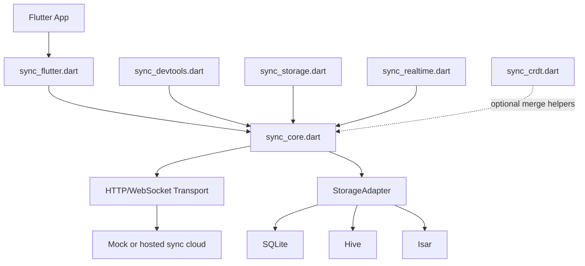
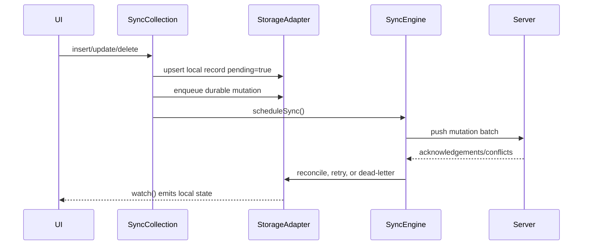

# OrbitSync Architecture

OrbitSync is published as one Flutter package with focused library entrypoints.
Core sync logic still has no Flutter or database dependency, which keeps it
portable across mobile, desktop, server-side Dart, and tests.

Most apps import the umbrella API:

```dart
import 'package:orbitsync/orbitsync.dart';
```

The internal entrypoints shown below keep concerns separated while still shipping
from the same package.



## Write path



## Core decisions

- **Offline first:** every mutation commits locally before network work starts.
- **Durable ordering:** adapters allocate monotonically increasing sequence
  numbers and flush mutations in sequence order.
- **Delta sync:** updates carry changed-field sets and patch payloads.
- **Conflict policy injection:** built-in policies cover common server/client
  strategies, while manual resolvers support domain-specific merges.
- **Realtime as invalidation:** websocket messages trigger pull/push cycles so
  reconnects can recover using checkpoints.
- **Storage bridges:** SQLite/Hive/Isar adapters share the same key-value
  persistence layer, reducing behavioral drift between engines.

## Scalability notes

- Query APIs support pagination through `QueryOptions.limit` and `offset`.
- Sync batches are bounded by `SyncEngine.batchSize`.
- Retry attempts use exponential backoff with jitter to protect servers.
- DevTools caps in-memory timeline rendering to avoid runaway memory use.
